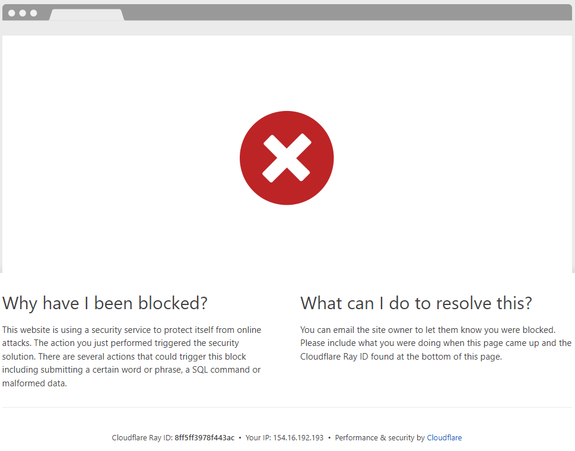

# Automatisation et Cloudflare : Un Défi

**Important :**

* **Conditions d'utilisation :** Respectez toujours les conditions d'utilisation de Cloudflare et du site web que vous automatisez.
* **Éthique :** Utilisez Selenium de manière responsable et évitez de surcharger les serveurs avec des requêtes excessives.
* **Évolution :** Les techniques de détection des bots sont en constante évolution.  Restez informé des dernières pratiques et adaptez votre approche en conséquence.

L'utilisation de robot avec des sites protégés par Cloudflare peut être complexe en raison des mesures anti-bot de Cloudflare.

Résultat avec l'ancien code utilisant selenium avec un VPN activé ou non :

La première page s'ouvre correctement, mais à la seconde, tout se bloque.
